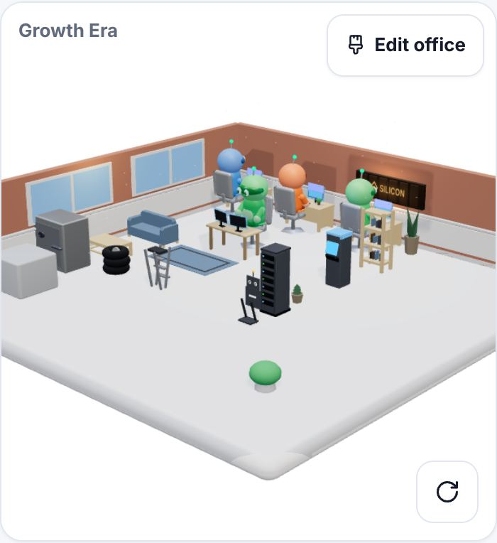
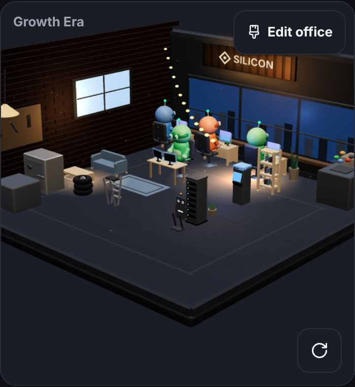
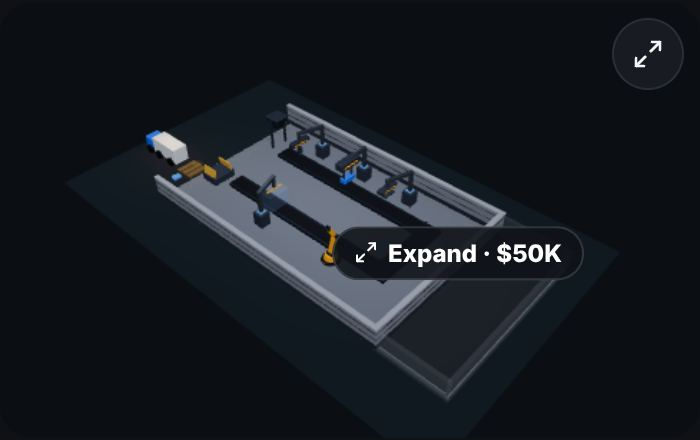
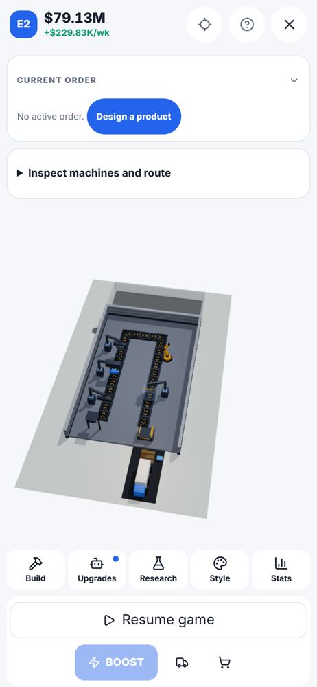

# Office + Factory 3D — handoff

> For the next Claude Code session (run locally on the owner's PC) or anyone picking up the two
> 3D worlds. Written 2026-10-10 against `main` @ `070452e` (1.4.0). Goal from the owner (Isac):
> **fix the 3D world for the office and the factory** so both look premium and consistent, with
> the same plan used for Airline Empire's hub: a written target, a gap list, one PR per step, a
> render-and-compare loop, and a Meshy + Blender model pipeline.

Read in this order:

1. This file — state, target, gaps, the plan, how to check yourself.
2. [`WORLDS_3D_MODEL_LIST.md`](WORLDS_3D_MODEL_LIST.md) — every model, its size, budget, front
   direction and material names.
3. [`WORLDS_3D_PIPELINE.md`](WORLDS_3D_PIPELINE.md) — how the models get made (Meshy + Blender
   MCP + `scripts/models/`).
4. Repo rules: `CLAUDE.md`, `DEV.md` (premium mandate, protected `engine/`, determinism, design
   tokens, no real brands).

---

## 1. Where things stand

| Area | Where | State |
|---|---|---|
| Office scene | `src/garage3d/Garage3D.tsx` (+ `room.tsx`, `furniture3d.tsx`, `lighting.tsx`, `cameraRig.tsx`, `officeArrangement.ts`, `robotCharacter.tsx`) | R3F, ACES tone mapping, studio IBL from Lightformers, contact shadows. Two different rooms: light = floating diorama slab, dark = full garage. |
| Office furniture | `public/furniture/*.glb` (23 Kenney CC0, 28–200 triangles each) + ~86 code-built pieces | Re-finished at runtime by **material name** → family (`materialFamilies.ts`, `furnitureFinish.ts`). Drop-in seam: replace a file with the same id and material names. |
| Office robots | `robotCharacter.tsx` (code-built); seam `robotModels.ts` → `src/garage3d/models/robot_*.glb` | **All robots are code-built today.** `base.glb` (RobotExpressive) is inactive. Drop `robot_shared.glb` and every employee uses it, tinted on material `Main`, clips `Idle`/`Sitting`/`Walking`. |
| Factory scene | `src/components/Factory3D.tsx` (2 154 lines), `FactoryMode.tsx`, helpers in `src/garage3d/factory*.ts`, `machineMounts.ts` | R3F, **100 % code-built, no GLB seam**, own hard-coded palette `C`, **default tone mapping** (office uses ACES). Card preview + fullscreen mode, SVG fallback. |
| Tests | `src/garage3d/*.test.ts`, `src/engine/factory*.test.ts` | 214 files / 2 184 tests green on `070452e`. `palette.test.ts` + `furnitureFinish.test.ts` read the shipped furniture GLBs. |
| Captures | `npm run shots:worlds` (**new**, `scripts/world-shots.mjs`) | Office card + decorate, factory card + fullscreen (+ close-up), light + dark, compare page. `shots:diff` covers the 2D screens and never opens the factory. |
| Model tools | `scripts/models/` (**new**) | manifest (52 models), Blender cleanup → GLB, validator + CI workflow. |

### How it looks today (`070452e`, staged mid-game save, iPhone-size viewport)

| Office, light | Office, dark | Factory card, dark | Factory fullscreen, light |
|---|---|---|---|
|  |  |  |  |

More in `docs/worlds3d/` (decorate view, the other theme of each).

### Honest verdict

The **dark office** is the closest to premium (warm brand wall, window, string lights). The
**light office** reads as a small room floating in a white void with low-detail furniture. The
**factory** reads as a different, plainer game: dark grey boxes on a grey slab, small in its
frame, with its own palette and tone mapping. Neither world matches the **robot portraits** the
game ships (`public/art/redesign/robot-*.webp`) — that art is the clearest statement of the target.

## 2. The target

There is no reference video for Silicon. The target is:

1. **The portraits** in `public/art/redesign/` (owner-approved): premium, approachable, stylised
   3D — rounded bevelled forms, satin plastic, clean colour blocks, navy glass visor, big white
   oval eyes.
2. **The owner's approved office mockup** (an offline render referenced in
   `docs/redesign/assets.json`, **not in the repo**). Ask Isac for it and drop the frames into
   `.world-shots/reference/<theme>-<frame>.png` (git-ignored) — they become the first column of
   the compare page.
3. **One studio, two worlds**: office and factory share palette families, lighting, tone mapping
   and characters, so switching tabs feels like the same game.
4. **Both themes** look finished (light and dark build different rooms — check both, always).

"Done" is not pixel-matching an offline render; it is the owner looking at the compare page and
seeing the portraits' world.

---

## 3. Gap list

Each gap: what is wrong, where, and the fix. Verified against the captures above unless marked.

### Office

| # | Gap | Where | Fix |
|---|---|---|---|
| O1 | Light theme: the room is a small diorama in a white void; the front ~40 % of the card is empty floor/void; the room reads tiny on a phone. | `cameraRig.tsx` (`CAM_REST_POSITION`, `REST_FRAME`), `room.tsx` `DioramaRoom` | Frame to the occupied bounds of the room per tier and aspect (the factory's `factoryFrame` corner-fit is the model); tighter slab margin; ground the diorama with a soft floor shadow/backdrop instead of pure white. |
| O2 | Robots don't match the portraits (different head, face and proportions) and dominate the desks (FOLLOWUP_AUDIT). | `robotCharacter.tsx`, `robotModels.ts` | `robot_shared.glb` through the pipeline (model list §1, priority 1). Re-tune `ROBOT_SCALE`/`SIT_LIFT` against the new chair and desk heights. |
| O3 | Furniture is low-detail (Kenney 28–200 triangles, flat tan wood), unlike the portraits' finish. | `public/furniture/*.glb`, `furnitureModels.ts` | Replace the 23 GLBs with pipeline models, same ids and material names (model list §2); keep `realHeight`/`surfaceHeight`/`shelfRows` true to the new geometry; the code-built pieces get the same bevel/finish pass. |
| O4 | Light and dark are two different rooms with different moods; light has none of dark's warmth (window light, string lights, lit brand wall). | `room.tsx` (`DioramaRoom` vs garage), `lighting.tsx` | Decide one art direction per tier, then carry the warm accents into light: window light pool, lit brand wall, a warmer key. Keep the two shells if the owner wants them, but match materials and light. |
| O5 | Era doesn't change the office look (no `eraVisual.ts`, phase-0 audit gap). | new `src/garage3d/eraVisual.ts`, `officeConfig.ts` | Era → wall/floor finish set, light temperature, a signature prop. Presentation-only; never read by `engine/`. |
| O6 | No quality setting; DPR caps hard-coded. | `Garage3D.tsx`, `Factory3D.tsx`, `state/settings.ts` | Low/High setting (DPR, shadows, contact-shadow resolution, dust) defaulting by device; needed before heavier models. |
| O7 | *Likely bug (verify):* the office arrangement `useMemo` reads `officeSeed()`/`officeWeek()` without them in its deps, so weekly dressing variation doesn't re-roll until layout/tier/headcount change. | `Garage3D.tsx:918-921`, `officeDressing.tsx:36-51` | Pass seed and week as props (or a `useSyncExternalStore` on `officeLive`) and add them to the deps; add a test. Cosmetic-only stream (salt 467) — no engine impact. |
| O8 | Doc drift: models README says robots fit ~1.5 m, `gltfRobot.tsx` uses 1.7 m; `Garage3D.tsx` header still says "zero image assets". | `src/garage3d/models/README.md`, `Garage3D.tsx` | Fix the text when touching those files. |

### Factory

| # | Gap | Where | Fix |
|---|---|---|---|
| F1 | Fullscreen: the floor fills ~35 % of the screen, near top-down, between a tall order card and the tool bar; machines read as dots. | `factoryFraming.ts` (`factoryFrame`), `FactoryMode.tsx` layout | Fit the camera to the space **between** the HUD panels (pass the free rect, not the canvas), pitch ~45–50°, collapse the order card to one line when idle. Update `factoryFraming.test.ts`. |
| F2 | Card: the "Expand · $50K" pill sits in the middle of the scene. | `Factory3D.tsx` locked-bay `<Html>` | Anchor it to the locked bay's edge or a card corner chip; never over the line. |
| F3 | Theme mismatch: the light-theme card renders on near-black; the light fullscreen floats on pale grey. | `Factory3D.tsx` grounds/backdrop, `FactoryMode.tsx` | Theme-aware ground and backdrop from the same tokens the office uses. |
| F4 | Looks like another game: own hex palette `C`, default tone mapping, different light rig. | `Factory3D.tsx:58-89`, Canvas `gl` | ACES + the office's exposure; the office's Lightformer environment; map `C` onto `palette.ts` `CATALOG` families (and add a palette test like the office's). |
| F5 | Machines, props, truck and AGVs are primitive boxes; no way to drop in models. | `Factory3D.tsx` machine/prop components | **Add a GLB seam** like the furniture one: `src/garage3d/factoryModels.ts` registry → `public/factory/<key>.glb`, `ModelBoundary` + `Suspense` with the code-built piece as fallback, fit to cells, materials mapped by name (`body`, `accent`, …, model list §0), animated parts found by node name (`press-ram`, `arm-yaw`, …) so `factoryMotion` keeps driving them. Exclude `public/factory` from precache. |
| F6 | No people on the floor (FACTORY_WORLD_PLAN P2 still open). | `Factory3D.tsx` | Reuse the robot (code-built now, `robot_shared.glb` later) at stations of the active recipe; cosmetic, derived from existing state. |
| F7 | The building sits on a bare slab; no yard, fence, parking or road context. | `Factory3D.tsx` grounds | Exterior dressing ring (yard lines, fence, a few trees/lamps) in the shared palette; static, instanced. |
| F8 | Up to three live WebGL contexts (hidden office + factory card + fullscreen), untested on old iPhones. | `HQ.tsx`, `FactoryMode.tsx` | Unmount the card's canvas while fullscreen is open (or reuse it); device test per PRE_TESTFLIGHT_AUDIT. |
| F9 | *Verify:* in the headless capture a mouse-wheel zoom did not move the fullscreen camera. | `Factory3D.tsx` `OrbitControls` | Check desktop wheel zoom on a real browser; pinch is the phone path. |

---

## 4. The plan (one PR each, each closed by a world-shots compare page)

| Step | What | Done when |
|---|---|---|
| **1. Framing + theme** | O1, F1, F2, F3. No assets. | Both worlds fill their frames on 390×844 and an iPad size, in both themes; the pill never covers the line; tests for framing updated. |
| **2. One look** | F4, O4: shared tone mapping, environment, palette families; warm accents in light. | Office and factory side by side read as one game; `palette.test` covers the factory palette. |
| **3. The robot** | O2 (+ F6 using it). Pipeline §2. | Office robots match the portraits beside them on the compare page; sitting works on chairs and sofas; ≤ 16 skinned robots hold frame rate. |
| **4. Office furniture** | O3, model-list priority 2 then the rest. | Every replaced GLB passes `check_glb.py` + `npm test`; desk-top kit and shelf books land right. |
| **5. Factory models** | F5 seam first (with tests: fallback, fit, node-name animation), then machines → truck → props. | Machines animate exactly as before (audit node names), draw calls within budget. |
| **6. Polish** | O5 era visuals, O6 quality setting, F7 exterior, O7, O8. | Each era visibly different; Low preset measurably cheaper. |
| **7. Device + store** | F8, a 15–20 min dense-factory session on a real iPhone, then refresh the App Store frames (`npm run shots:store`). | Owner signs off the compare page; store frames updated. |

### Progress

- **Step 1 (framing + theme): in review** (branch `claude/worlds-3d-step1-framing`, stacked on this
  handoff). One framing rule for both worlds, `src/garage3d/cameraFit.ts`: slide the pivot across
  the floor until the box of what must be seen is centred, then fit the distance.
  - F1: `factoryFrame` centres the box (it filled ~65% of a phone stage, off-centre; now ~93% on
    the tight axis); the ghost bay's end of the box stops at its low walls; the idle order card is
    one line. **Bug found on the way:** fullscreen `CameraReset` ran its one-shot reset before
    OrbitControls registered (`makeDefault` sets it in an effect), so the pivot stayed on the
    controls' `target={[cx, 0.8, 0]}` prop — un-rotated for portrait — and the view aimed
    off-centre. It now waits for the controls; the prop is gone.
  - F9: with the pivot fixed, wheel zoom in the headless capture moves the camera (close-up frame).
  - F2: the Expand price is a DOM chip in the card's bottom-right corner, beside the ghost bay; the
    in-scene `<Html>` pill is gone.
  - F3: `--world-backdrop` (tokens) is the one backdrop for the office card, factory card and
    fullscreen stage in both themes; the factory grounds fade out into it (`groundFadeTexture`).
  - O1: `officeFrame` fits the cozy view per card aspect, tier and theme (same 3/4 look). Phones
    keep roughly the old scale (the room is a wide diamond, so its side tips may crop ≤ 15%) but it
    is centred; iPad-width cards get a ~16% larger room. The light diorama gets a soft ground shadow.
  - Not done here: decorate-mode framing (unchanged), the `shots:worlds` iPad pass is
    `SHOTS_VIEWPORT=820x1180 npm run shots:worlds -- <label>`.
- **Factory audit (same branch, 2026-10-11).** Three code reviews (3D scene, Factory UI, factory
  engine) plus a scripted playthrough on the real build (paint, undo, tap, place, erase,
  hold-to-move, ghost-bay tap, Escape, week tick) in both themes. Fixed: Undo refunding 100% weeks
  later (history now ends when a week passes); BOOST charging an unshown premium and saving nothing
  on a run's last week (`rushCost`, price on the button, refused at ≤ 1 week); double-taps on Place,
  Expand-confirm and side-order cancel; a belt drag past the grid edge collapsing to one tile; the
  invisible tap pad baking a dark film over the whole floor (ContactShadows); erase/upgrade taps on
  a machine's tall parts; the bay's tap box stealing taps on the last column; traveling items
  bunched on a line wired after mount; a pickup stuck in hand; the ghost/placed mount mismatch;
  diagonal "works here" hints; the arm wrist twitching with frame time; the card chip on a client
  order; tutorial focus; the camera hint after the tutorial; the 2D fallback ghost size; a no-op
  move adding an Undo entry. Camera: re-fits on layout changes only until the player moves it.
  Owner decisions + low-priority leftovers are in `TASK.md` → Backlog (2026-10-11).

## 5. How to check yourself

```bash
npm run build
npm run shots:worlds -- before      # BEFORE editing (the pre-change build)
# ...change...
npm run build
npm run shots:worlds -- after
open .world-shots/compare.html      # (start … on Windows) reference | before | after
npm test && npm run typecheck
```

- Read at least one frame per world yourself before calling a change done (repo skill
  `visual-change-shots`).
- `.world-shots/` is git-ignored; never commit captures or the owner's mockup.
- `SHOTS_THEMES=dark` for one theme while iterating; `SHOTS_SAVE=<json>` for a specific save.
- Draw calls: `node scripts/probe-scenes.mjs` before/after any model or lighting change.

## 6. Rules and traps

- **Presentation only.** Nothing here may touch `src/engine/` or change a simulation number.
  Furniture attributes feed `officeZoneBonus` — replacing a model must not change ids,
  footprints or attrs. New cosmetic randomness uses a derived hash with a **fresh salt**
  (in use up to 479 — see `CLAUDE.md`).
- **Determinism pin** stays green; run `npm test` before every commit.
- **Design tokens only** in UI; the 3D palette lives in `palette.ts` with the saturated-colour
  allowlist (`palette.test.ts` fails on new saturated hex in `furniture3d.tsx`/`palette.ts`).
- **Material names are API**: a new furniture material name must be added to
  `MATERIAL_FAMILY_BY_NAME` and to the test list together.
- **Keep the fallbacks**: every GLB load sits behind `ModelBoundary`/`Suspense` with the
  code-built piece; a missing or broken file must never blank a tile.
- **Performance**: don't raise DPR caps; keep point-light counts constant (no shader recompiles);
  throttle cosmetic `useFrame` work; pooled GPU objects (`sharedGpu.ts`) as props, not children;
  GLBs out of the PWA precache.
- **Both themes, always** — they build different rooms.
- **No real brands** anywhere, including signage and model details.
- **Licences**: only CC0/permissive or self-generated models (paid Meshy plan for commercial use).
- **Reduce Motion**: every new animation respects `still`/`reduced` like the existing ones.

## 7. Open questions for the owner

1. Can you share the approved office mockup frames (for `.world-shots/reference/`)?
2. Light and dark: keep two different rooms, or one room in two lightings?
3. Meshy plan + Blender on the PC: ready to run the robot first?
4. Factory workers: robots like the office, or a distinct factory-crew look?
